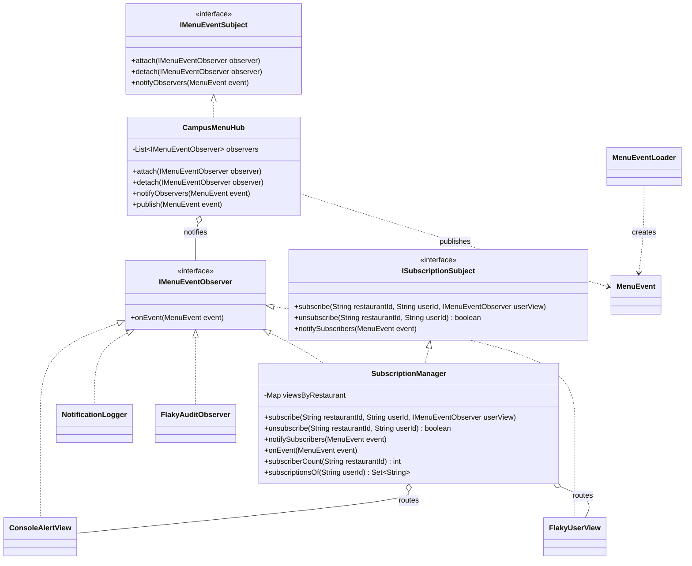

# HW3 Observer 구현

이벤트 모델과 로더, 2단 Observer 체인, 실패 처리, 구독 관리 및 실행 예제를 구현했습니다.
App은 프로젝트 루트의 events.jsonl을 읽어 이벤트를 순서대로 발행합니다.

## 파일 역할

| 구분 | 파일 |
| --- | --- |
| 이벤트 데이터 | MenuEventType.java, MenuEvent.java |
| 파일 로딩 | MenuEventLoader.java |
| 공통 규약 | IMenuEventObserver.java, IMenuEventSubject.java, ISubscriptionSubject.java |
| 이벤트 허브 | CampusMenuHub.java |
| 식당별 구독 관리 | SubscriptionManager.java |
| 허브 관찰자 | NotificationLogger.java, FlakyAuditObserver.java, PriceChangeAlertObserver.java |
| 사용자 뷰 | ConsoleAlertView.java, FlakyUserView.java |
| 실행 및 동작 확인 | App.java |

## 연결 구조

CampusMenuHub -> NotificationLogger / FlakyAuditObserver / SubscriptionManager / PriceChangeAlertObserver

SubscriptionManager -> 해당 식당을 구독한 사용자 뷰

## 클래스 다이어그램

## 주요 클래스 역할

- `MenuEvent`: 메뉴 변경, 품절, 가격 변경, 신메뉴 정보를 담는 이벤트 데이터이다.
- `MenuEventLoader`: `events.jsonl`을 읽어 `List<MenuEvent>`로 변환한다.
- `IMenuEventObserver`: 이벤트를 받는 객체가 구현하는 공통 인터페이스이다.
- `IMenuEventSubject`: 허브 Observer의 등록, 해제, 통지를 정의한다.
- `CampusMenuHub`: 메뉴 이벤트를 모든 허브 Observer에게 전달하는 1단계 Subject이다.
- `NotificationLogger`: 모든 메뉴 이벤트를 콘솔 로그로 출력하는 Observer이다.
- `FlakyAuditObserver`: Observer 하나가 실패해도 나머지 통지가 계속되는지 확인하는 테스트용 Observer이다.
- `ISubscriptionSubject`: 식당별 사용자 구독 등록, 해제, 통지를 정의한다.
- `SubscriptionManager`: 허브에서는 Observer로 동작하고, 사용자 뷰에는 Subject로 동작하여 해당 식당의 구독자에게만 이벤트를 전달한다.
- `ConsoleAlertView`: 사용자에게 메뉴 알림을 출력하는 Observer이다.
- `FlakyUserView`: 사용자 뷰 하나가 실패해도 같은 식당의 다른 구독자에게 계속 통지되는지 확인하는 테스트용 Observer이다.
- `App`: 객체 생성, Observer 연결, 구독 등록, 이벤트 발행과 추가·삭제 동작을 실행한다.

## 실행

IntelliJ에서 이 폴더를 프로젝트로 열고, 실행 작업 디렉터리를 `HW3_OBSERVER`로 설정한 뒤 `App.main()`을 실행합니다. JDK 17 이상이 필요합니다.

실행 시 파일 이벤트 7건, 식당별 사용자 알림, 두 종류의 실패 경고, 구독 해제 및 yourcode의 가격 변경액 분석 결과가 출력됩니다.

## 제출 전 확인

- 원본 events.jsonl을 이 프로젝트 루트(src와 같은 위치)에 복사해 두었습니다.
- record 사용을 위해 Java 17 이상을 권장합니다.
- yourcode는 가격 변경액을 계산해 인상·인하를 출력하는 PriceChangeAlertObserver입니다. App에서 추가·삭제 결과를 확인합니다.
- 보고서와 함께 Java 소스 및 events.jsonl을 제출합니다.
